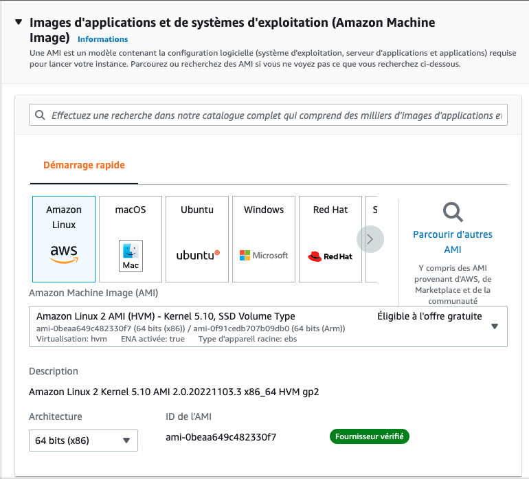
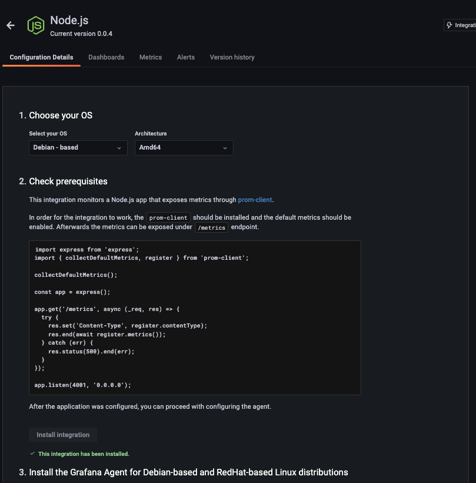

# Cas Pratique DevOps

## Exercice

Pré-requis : 

- AWS Account avec une instance EC2 gratuite
- Grafana Cloud Account
- Github Account
- Read about Docker Multi-Stage build

Objectif :

Déployer un service web sous Docker dans le cloud et récupérer les métriques Node.js sur Grafana 

- Réparer le Dockerfile qui comporte une erreur de build
    
    ```bash
    docker build -t myapp .                                                                                                                                              13:06:52
    Sending build context to Docker daemon  4.096kB
    Step 1/9 : FROM node:lts-alpine3.16 as deps
     ---> 6e983a17c040
    Step 2/9 : WORKDIR /app
     ---> Using cache
     ---> d0b422cb8552
    Step 3/9 : COPY package.json ./
     ---> Using cache
     ---> 6e375c946e5c
    Step 4/9 : FROM node:lts-alpine3.16 AS builder
     ---> 6e983a17c040
    Step 5/9 : WORKDIR /app
     ---> Using cache
     ---> d0b422cb8552
    Step 6/9 : COPY . .
     ---> 9efc02c22ddc
    Step 7/9 : COPY --from=deps /app/node_modules ./node_modules
    COPY failed: stat app/node_modules: file does not exist
    ```
    
- Déployer le conteneur sur une instance EC2
    
    
    
- Récupérer les métriques NodeJS dans Grafana en suivant le guide d’intégration sur votre instance Grafana (https://<INSTANCE-NAME>.grafana.net/a/grafana-easystart-app/nodejs).
    - Le conteneur expose “/metrics” (Etape 2)
        
        
        

Bonus : 

- Exposer le service sur le port 443 et sécuriser l’accès avec HTTPS (Nginx, Haproxy, Openssl, Let’s Encrypt)
- Système de déploiement automatique du conteneur (Ansible, Github Actions, Terraform)